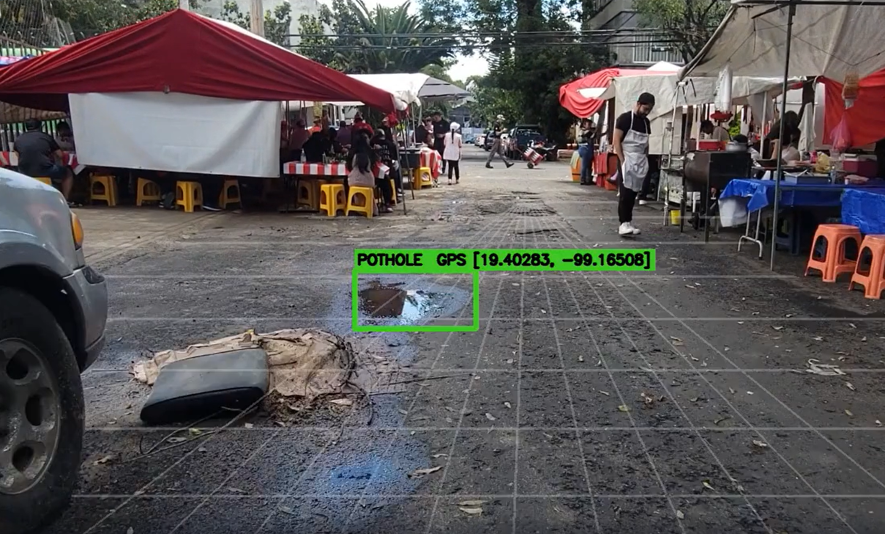
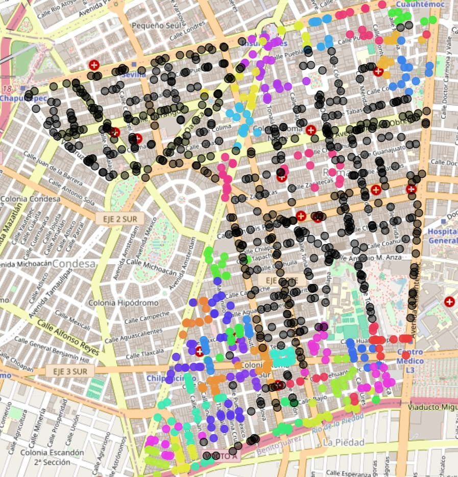

# team-21 Platanus Hack 26: CityCrawl

Track: ☎️ Legacy

team-21

- Pablo César Ruíz Hernández ([@pcruiher08](https://github.com/pcruiher08))
- Elias Garza Valdes ([@eliasgarzav](https://github.com/eliasgarzav))
- Andrés Alam Sánchez Torres ([@aast12](https://github.com/aast12))
- Sofia Ingigerth Cañas Urbina ([@sicupath](https://github.com/sicupath))
- Roberto Mendivil ([@robertomendivil97](https://github.com/robertomendivil97))

---

**CityCrawl** detecta, prioriza y optimiza la reparación de infraestructura urbana
(baches, coladeras, luminarias, señalización) combinando video a nivel calle,
modelos de visión y datos externos de riesgo en un **mapa de prioridad** que decide
dónde gastar el presupuesto.

🌐 **[citycrawl.dev](https://citycrawl.dev)** — `tester@citycrawl.dev` / `Test1234!`

---

## Pipeline

1. **Captura.** Cámaras en rutas o montadas en flotas que ya circulan (camiones de
   basura). Video con timestamp georreferenciado → Cloudflare R2 (`sweep-video`)
   para procesamiento offline.
2. **Detección.** Modelo de visión sobre el video → `vision.observations`:
   problemas tipados, ubicados, con confianza y referencia al frame de origen.
3. **Prioridad.** Cruza observaciones con riesgo externo (accidentes SSC, crimen
   FGJ) anclado a geografía INEGI (AGEE → AGEM → AGEB) → mapa de prioridad
   (capas de instancias y de calor).
4. **Problemas latentes.** Zonas de alto riesgo **sin** detecciones se marcan como
   ROIs y se corre un **VLM** sobre los timestamps de video de esa región para
   hipotetizar lo que el detector no vio (iluminación, semáforos faltantes).
5. **Optimización.** Dado un presupuesto, maximiza impacto/peso (ver abajo).

## Optimización del gasto

`ActionableOptimization/pipeline`: agrupa baches por calle en *clusters* →
*superclusters* (tope de puntos), estima flujo vehicular con la **TomTom Traffic
Flow API**, y hace selección **greedy** de superclusters por peso descendente
hasta agotar el presupuesto.

- **Peso (descontento)** = `velocidad × flujo vehicular semanal × volumen`
- **Costo** por supercluster = `costo por viaje + costo por m3 de pavimentacion × volumen total`

**Superclusters:** clusters de baches cercanos (agrupados por calle) que se fusionan
de forma greedy por centroide más cercano hasta un tope de puntos, formando un frente
de trabajo contiguo.
**Técnica optimizada:** en vez de bachear hoyos sueltos, se repavimenta el segmento
completo en una sola salida — amortizando el costo fijo por viaje y maximizando el
descontento aliviado por peso invertido.

## Operación en lenguaje natural (Track ☎️ Legacy)

- **Prompts** → `/v1/llm/drafts:parse` (adaptador Anthropic) resuelve *"mejor ruta
  en Gustavo A. Madero, presupuesto 3M"* contra el catálogo INEGI a un **borrador
  editable**. Nunca ejecuta directo: el usuario confirma el draft estructurado.
- **WhatsApp** → `services/whatsapp-controller` (Kapso): máquina de estados de dos
  mensajes (foto + pin de ubicación, porque WhatsApp borra el EXIF GPS) que postea
  a `POST /v1/observations/citizen` y la observación aparece en el mapa.

## Arquitectura

| Componente | Stack | Notas |
|---|---|---|
| Web app | Vite + React + Tailwind v4, Cloudflare Pages | lee RPCs `public.app_*`; llama a la API de planning |
| API | FastAPI (monolito modular), Fly.io | `/v1/planning/optimize`, `priorities:cluster`, `llm/drafts:parse`, `datasets/refresh` (NDJSON) |
| Optimización | Python + TomTom Traffic API | clustering → superclustering → greedy por presupuesto |
| Broker de medios | Cloudflare Worker | `GET /api/r2/object`; autoriza vía RPC `public.app_authorize_object` antes de streamear R2 |
| Datos y auth | Supabase (PostgreSQL/PostGIS) | RLS por inquilino, geografía INEGI, observaciones, prioridades |
| WhatsApp | Node/TS + Kapso | reportes ciudadanos foto + pin |

Buckets R2 privados: `sweep-video`, `observation-thumbnails`, `tenant-tiles`,
`external-data`. Sin Supabase Storage ni URLs firmadas — todo medio pasa por el broker.

**Runs reproducibles:** cada análisis congela sus insumos (geografía, observaciones
elegibles, presupuesto, versión de proveedor), así el resultado es explicable y
repetible aunque los datos en vivo cambien durante el cómputo.

## Datos de riesgo

Fuentes primarias de open data gubernamental, en lotes anuales (el batch geolocalizado
más fresco es 2024): SSC *Hechos de tránsito* (accidentes CDMX), FGJ *Carpetas de
investigación* (crimen CDMX), INEGI *Marco Geoestadístico*. Son **priors espaciales
estables** — dónde se concentran riesgos —, no un feed en tiempo real (no existe uno
abierto). Investigación completa: [`docs/research/external-risk-datasets.md`](docs/research/external-risk-datasets.md).

## Despliegue

Stack reproducible de punta a punta desde un runbook:
**[`docs/DEPLOYMENT.md`](docs/DEPLOYMENT.md)** (orden de dependencias, matriz de env,
verificación, fallas comunes).

Por componente: [`frontend`](frontend/README.md) ·
[`api`](services/api/README.md) · [`broker`](services/broker/README.md) ·
[`whatsapp-controller`](services/whatsapp-controller/README.md) ·
[`supabase/seed`](supabase/seed/README.md).
