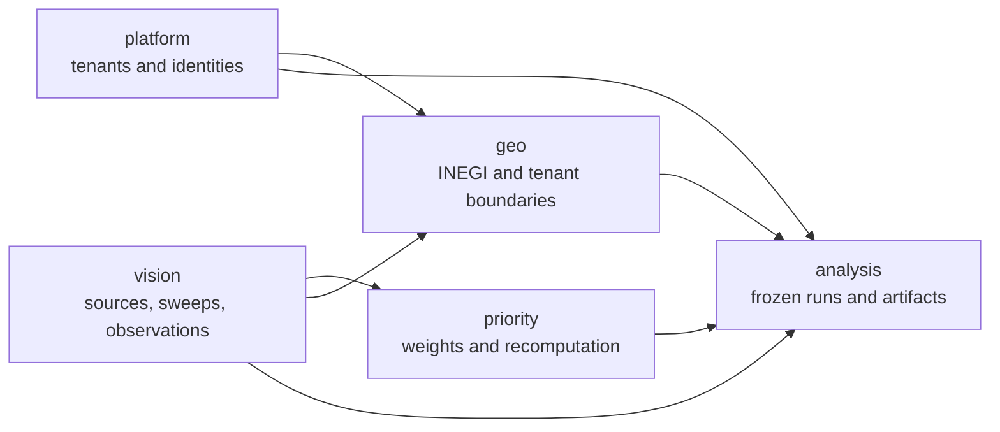
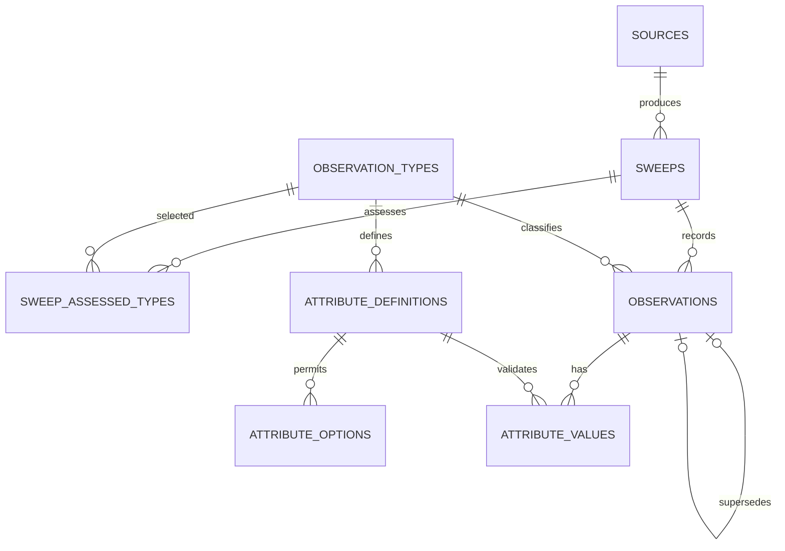
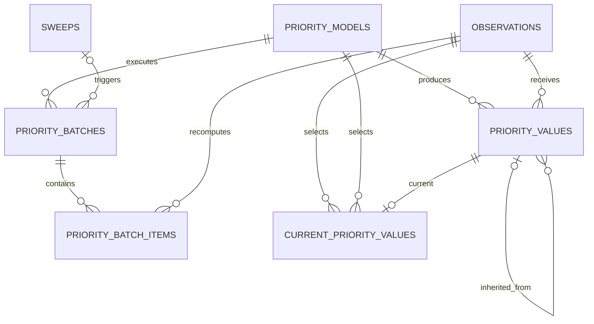
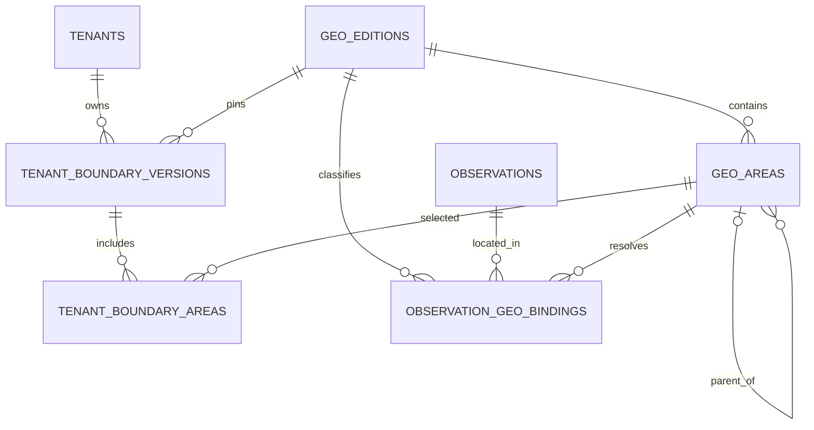
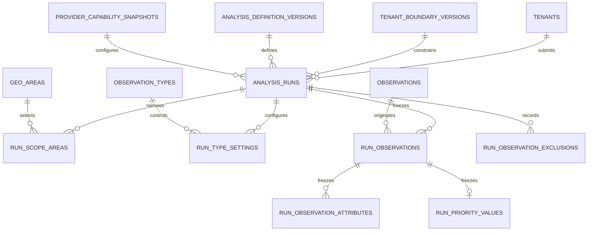
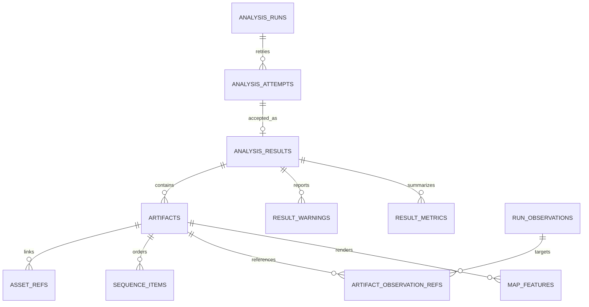

# Application Data Model - Design

**Date:** 2026-06-20
**Status:** Approved logical model
**Component:** Shared observations, geography, priorities, and analysis persistence

---

## 1. Scope

This spec defines the logical data model for the application described in the
application-system-architecture design. It covers:

- Shared camera sources and sweep provenance.
- Current infrastructure observations and their factual measurements.
- Source-independent supersession, miss tracking, and reviewed resolution.
- Priority inheritance and asynchronous recomputation.
- INEGI geographic reference data and tenant boundaries.
- Budget-analysis definitions, frozen inputs, execution attempts, and extensible results.
- Tenant membership, authorization relationships, and audit events.

PostgreSQL with PostGIS is the intended persistence platform. This document does not
specify SQL DDL, migrations, indexes, containers, an ORM, or other implementation
tooling.

The model preserves module ownership even when all modules use one physical database.
The names `platform`, `vision`, `priority`, `geo`, and `analysis` below denote logical
ownership domains. They may become PostgreSQL schemas, but that is an implementation
decision.

### 1.1 Decisions superseded from earlier specs

This design refines the earlier observation and application architecture specs. Where
they differ, this document controls the logical data model:

- Tenant boundaries replace the city as the map and analysis scope.
- All sources and observation facts are shared across tenants. There is no
  `tenant_sources` relationship.
- A sweep belongs to a source, but source identity does not affect observation matching,
  miss detection, priority, or map visibility.
- Type-specific observation facts use definitions and typed value records rather than an
  `attributes` JSON object.
- Priority is not activated as an all-or-nothing geographic run. Operational batches
  recompute individual current values.
- A superseding observation inherits usable computed priority and marks it for
  recomputation with the new sweep's batch.

The original observation lifecycle remains otherwise intact: observations are factual
rows, newer nearby rows supersede older rows, absence produces miss evidence, and
resolution is reviewed.

## 2. Modeling Principles

1. **Facts and computed values remain separate.** Vision owns observed facts. Priority
   owns derived weights. Analysis providers own costing, allocation, clustering, routing,
   and other analytical calculations.
2. **Sources provide provenance, not tenancy.** A source identifies a camera system. Its
   data is available to every tenant, subject to the tenant's geographic boundary.
3. **Current state is derived from history.** Superseded and resolved observations remain
   stored; current observations are those with neither outcome.
4. **Tenant scope is geographic.** A tenant boundary is a versioned union of INEGI areas.
   Map and analysis queries are clipped to that boundary.
5. **Submitted analyses are reproducible.** A run owns frozen copies of the facts,
   measurements, priority values, provider contracts, and geographic versions used at
   submission.
6. **Extensibility is explicit.** Observation types and factual fields are catalog data.
   Analysis interfaces and result artifacts are versioned contracts.
7. **Mutation is narrow.** Factual records are immutable after insertion. Only defined
   lifecycle pointers, counters, statuses, and current-value references may change.

## 3. Domain Overview

| Domain | Owns | May reference |
|---|---|---|
| `platform` | Tenants, OIDC subjects, memberships, audit events | Analysis and geography targets by stable identifier |
| `vision` | Sources, sweeps, type catalog, observations, factual values | Media handles owned outside this model |
| `priority` | Models, work batches, immutable values, current pointers | Vision observations and sweeps |
| `geo` | INEGI editions and areas, tenant boundaries, observation bindings | Platform tenants and vision observations |
| `analysis` | Providers, definitions, runs, frozen inputs, attempts, results, artifacts | Every upstream domain through pinned records |

Cross-domain references never transfer ownership. For example, `priority` may reference
an observation identifier but may not update the observation fact.

## 4. Platform Identities

### 4.1 Entities

#### `tenants`

Represents an organization using the application.

| Field | Meaning |
|---|---|
| `id` | Stable tenant identifier |
| `name` | Display name |
| `status` | `active` or `disabled` |
| `created_at` | Creation time |

Tenant identity does not appear on sources, sweeps, observations, or priority values.

#### `oidc_subjects`

Maps an external identity-provider subject into the application.

| Field | Meaning |
|---|---|
| `id` | Internal stable identifier |
| `issuer` | OIDC issuer |
| `subject` | OIDC subject within the issuer |
| `display_name` | Optional presentation name |
| `status` | `active` or `disabled` |

The pair `(issuer, subject)` is unique.

#### `tenant_memberships`

Associates a subject with a tenant and one baseline role.

| Field | Meaning |
|---|---|
| `tenant_id` | Tenant receiving the membership |
| `subject_id` | OIDC subject |
| `role` | `viewer` or `analysis_author` |
| `created_at` | Grant time |

A subject may belong to multiple tenants. Tenant context must therefore be explicit in
each application request.

## 5. Vision Facts and Observation Lifecycle

### 5.1 Entity relationships

### 5.2 Catalog and provenance entities

#### `sources`

Identifies the camera system that produced a sweep.

| Field | Meaning |
|---|---|
| `id` | Stable source identifier |
| `slug` | Unique machine-readable name |
| `name` | Display name |
| `status` | `active` or `retired` |
| `created_at` | Registration time |

All tenants may consume facts from every source. Source identity is retained for
provenance, diagnostics, and capture operations only.

#### `observation_types`

Defines an extensible infrastructure-observation type.

| Field | Meaning |
|---|---|
| `id` | Stable identifier |
| `slug` | Unique machine-readable key, such as `pothole` |
| `label` | Display label |
| `category` | Broader grouping |
| `description` | Human explanation |
| `merge_radius_m` | Maximum distance for same-type supersession matching |
| `auto_resolvable` | Whether repeated qualifying misses may automate resolution |
| `auto_resolve_miss_threshold` | High miss count required when automation is enabled |
| `status` | `active` or `retired` |

Every observation always has a type. `auto_resolvable = false` disables automatic
resolution; it does not make the type or threshold concept null.

#### `sweeps`

Represents one survey pass and the area it examined.

| Field | Meaning |
|---|---|
| `id` | Stable sweep identifier |
| `source_id` | Camera system that produced the sweep |
| `coverage` | PostGIS geography swath examined by the sweep |
| `started_at` | Capture start |
| `ended_at` | Capture end |
| `created_at` | Ingest time |

#### `sweep_assessed_types`

Records the types that a sweep was capable of finding. The relationship is explicit
rather than an array so every referenced type is validated.

| Field | Meaning |
|---|---|
| `sweep_id` | Sweep |
| `observation_type_id` | Type assessed by the sweep |

The pair is unique.

### 5.3 Typed factual measurements

#### `observation_attribute_definitions`

Defines a factual field that may be recorded for one observation type.

| Field | Meaning |
|---|---|
| `id` | Stable definition identifier |
| `observation_type_id` | Owning type |
| `key` | Type-local key, such as `surface_area_m2` |
| `version` | Monotonic version of that type-local key |
| `label` | Display label |
| `value_kind` | `number`, `text`, `boolean`, or `option` |
| `unit` | Optional measurement unit |
| `required` | Whether producers must supply the value |
| `minimum_number` | Optional numeric lower bound |
| `maximum_number` | Optional numeric upper bound |
| `status` | `active` or `retired` |

The tuple `(observation_type_id, key, version)` is unique, with at most one active version
for each type-local key. A change to value kind, unit, or validation bounds creates a new
definition version. Retiring a version prevents new values without changing the meaning
of historical facts.

#### `observation_attribute_options`

Contains allowed codes for a definition whose `value_kind` is `option`.

| Field | Meaning |
|---|---|
| `id` | Stable option identifier |
| `definition_id` | Owning definition |
| `code` | Stable machine-readable value |
| `label` | Display label |
| `status` | `active` or `retired` |

#### `observation_attribute_values`

Stores one validated factual measurement for one observation.

| Field | Meaning |
|---|---|
| `observation_id` | Observation owning the fact |
| `definition_id` | Definition that supplies type, unit, and validation |
| `number_value` | Populated only for `number` definitions |
| `text_value` | Populated only for `text` definitions |
| `boolean_value` | Populated only for `boolean` definitions |
| `option_id` | Populated only for `option` definitions |
| `created_at` | Ingest time |

Exactly one value field is populated and it must match the definition's kind. Each
observation may have at most one value per definition. The definition must belong to the
observation's type. Values are immutable.

These are detector-supplied facts, such as pothole surface area or damaged-sidewalk
length. They are not priority scores, cost estimates, or optimization outputs.

### 5.4 Observations

#### `observations`

Stores one factual detection and its narrow lifecycle state.

| Field group | Fields | Mutability |
|---|---|---|
| Identity | `id`, `schema_version` | Immutable |
| Fact | `observation_type_id`, `location`, `observed_at` | Immutable |
| Provenance | `sweep_id`, `recording_id`, `frame_ref`, detector name/version, `detected_at` | Immutable |
| Image evidence | Normalized bounding-box coordinates when present | Immutable |
| Lifecycle signals | `confirmation_count`, `miss_count` | Controlled mutation |
| Supersession | `superseded_by_observation_id` | Set once |
| Resolution | `resolved_at`, `resolution_source`, `reviewed_by_subject_id` | Set once |
| Temporal validity | `valid_from`, `valid_to`, `created_at` | `valid_to` set once; others immutable |

An observation is current when it has neither `superseded_by_observation_id` nor
`resolved_at`.

### 5.5 Supersession and miss rules

For every newly ingested sweep:

1. Insert the sweep, its assessed types, the fresh observations, and their factual values.
2. For each fresh observation, find the nearest current observation of the same type
   within that type's `merge_radius_m`.
3. Match old and fresh observations one-to-one. A fresh row cannot supersede multiple old
   rows, and an old row cannot be superseded by multiple fresh rows.
4. Set the old row's supersession pointer and `valid_to` to the fresh observation time.
5. Set the fresh row's `confirmation_count` to the old count plus one.
6. Perform matching across all sources. `source_id` is not a matching constraint.
7. For remaining current observations whose types were assessed, determine whether the
   sweep coverage passed within the configured tolerance of their locations.
8. Increment `miss_count` when the sweep covered the location and did not produce the
   matched replacement. This records evidence only; it does not resolve the observation.

Nearest-match ties require deterministic ordering. Concurrent sweep ingests must prevent
two transactions from superseding the same current observation.

Resolution remains a separate reviewed action:

- A human may resolve selected current observations.
- High-miss automation may resolve a row only when its type is `auto_resolvable` and its
  `miss_count` meets that type's configured threshold.
- A later detection after resolution is a new current observation rather than a
  continuation of the resolved row.

#### `vision_outbox_events`

Records committed vision-domain changes that other modules must process, including sweep
completion, observation supersession, and resolution. Each event carries a stable event
identifier, event kind, affected entity identifiers, occurrence time, and delivery state.
Consumers treat delivery as at-least-once and use the event identifier for idempotency.

Priority inheritance starts from a committed supersession event rather than observing a
partially completed sweep transaction.

## 6. Priority Values and Recalculation

### 6.1 Entity relationships

Priority is shared across tenants and sources. It remains owned by the priority module.

### 6.2 Entities

#### `priority_models`

| Field | Meaning |
|---|---|
| `id` | Stable model-version identifier |
| `name` | Model family |
| `version` | Producer version |
| `status` | `active` or `retired` |
| `created_at` | Registration time |

Exactly one model version is active for the application's shared priority display and
new analysis submissions. Historical and frozen values continue to reference retired
versions.

#### `priority_batches`

Groups operational recomputation work. A batch coordinates jobs; it is not an
all-or-nothing active snapshot.

| Field | Meaning |
|---|---|
| `id` | Batch identifier |
| `model_id` | Model used for recomputation |
| `trigger_sweep_id` | New sweep that normally triggered the batch |
| `reason` | `new_sweep`, `model_refresh`, or `manual` |
| `status` | `queued`, `running`, `completed`, `completed_with_errors`, or `failed` |
| `created_at`, `started_at`, `completed_at` | Lifecycle times |

`trigger_sweep_id` is absent only for non-sweep refreshes.

#### `priority_batch_items`

| Field | Meaning |
|---|---|
| `batch_id` | Owning batch |
| `observation_id` | Observation to recompute |
| `status` | `pending`, `running`, `completed`, or `failed` |
| `failure_code` | Sanitized failure category when failed |
| `updated_at` | Latest item transition |

Each observation appears once per batch.

#### `priority_values`

Stores immutable priority values.

| Field | Meaning |
|---|---|
| `id` | Value identifier |
| `observation_id` | Scored observation |
| `model_id` | Model identity and version |
| `weight` | Numeric priority weight |
| `value_state` | `computed` or `inherited` |
| `inherited_from_value_id` | Predecessor value when inherited |
| `computed_by_batch_id` | Batch that produced a computed value |
| `created_at` | Value creation time |

An inherited value must reference a value for the superseded predecessor and the same
model. A computed value identifies its producing batch.

#### `current_priority_values`

Selects the currently usable value for each `(observation_id, model_id)` pair.

| Field | Meaning |
|---|---|
| `observation_id` | Observation |
| `model_id` | Priority model |
| `priority_value_id` | Current immutable value |
| `updated_at` | Selection time |

### 6.3 Inheritance flow

When a fresh observation supersedes an old one:

1. Vision publishes the committed old/new relationship and sweep identifier.
2. If the old row has a current priority value, priority creates a new value for the
   fresh row with the same weight and `value_state = inherited`.
3. The inherited value points to the old value and becomes current immediately.
4. The new observation enters the sweep's recomputation batch.
5. Successful recomputation inserts a `computed` value and moves the current pointer.
6. The inherited value remains in history for audit.
7. Failed or delayed recomputation leaves the inherited value usable and visibly marked.
8. If no predecessor value exists, the fresh observation is priority-pending until a
   computation succeeds.

Map and analysis consumers must surface whether a current weight is computed or
inherited. A submitted analysis freezes the state along with the numeric value.

Other derived modules use their own owned value records if they later need the same
inherit/recompute pattern. They do not add computed columns to vision facts.

## 7. INEGI Geography and Tenant Boundaries

### 7.1 Entity relationships

### 7.2 INEGI reference entities

#### `geo_editions`

| Field | Meaning |
|---|---|
| `id` | Edition identifier |
| `source_name` | INEGI dataset name |
| `source_release` | Source release identifier |
| `effective_date` | Dataset effective date |
| `checksum` | Imported source checksum |
| `status` | `importing`, `ready`, `active`, `failed`, or `retired` |
| `imported_at` | Import completion time |

Prior editions remain available for reproducibility. Exactly one ready edition is active
for new boundary drafts and new observation bindings. Existing boundaries and runs remain
pinned to their earlier editions.

#### `geo_areas`

| Field | Meaning |
|---|---|
| `id` | Stable identity within the imported edition |
| `edition_id` | Owning edition |
| `level` | `AGEE`, `AGEM`, or `AGEB` |
| `source_cvegeo` | Complete INEGI source key |
| `cve_ent`, `cve_mun`, `cve_loc`, `cve_ageb` | Preserved component keys where applicable |
| `name` | Source area name |
| `ageb_kind` | `urban` or `rural` for AGEB rows |
| `parent_area_id` | Requested AGEE to AGEM to AGEB hierarchy |
| `geometry` | Valid PostGIS polygon or multipolygon |

All source keys are strings so leading zeroes and check characters remain intact. The
pair `(edition_id, level, source_cvegeo)` is unique.

### 7.3 Tenant boundary entities

#### `tenant_boundary_versions`

Stores an immutable configured working boundary for a tenant.

| Field | Meaning |
|---|---|
| `id` | Boundary-version identifier |
| `tenant_id` | Owning tenant |
| `edition_id` | Pinned INEGI edition |
| `version_number` | Tenant-local monotonic version |
| `status` | `draft`, `active`, or `retired` |
| `materialized_geometry` | Union of selected area geometries |
| `geometry_checksum` | Audit identity for the union |
| `created_at`, `activated_at` | Lifecycle times |

A tenant has exactly one active boundary version. Activating a replacement retires the
previous active version without changing it.

#### `tenant_boundary_areas`

| Field | Meaning |
|---|---|
| `boundary_version_id` | Boundary version |
| `geo_area_id` | Selected INEGI area |

All members belong to the boundary's edition. A selection may represent a state, several
municipalities, selected AGEBs, or another union from the same edition. An ancestor and
its descendant cannot both be members because the descendant would be redundant.

#### `observation_geo_bindings`

Classifies an observation point under one INEGI edition.

| Field | Meaning |
|---|---|
| `observation_id` | Observation |
| `edition_id` | Classification edition |
| `agee_area_id` | Containing AGEE |
| `agem_area_id` | Containing AGEM when available |
| `ageb_area_id` | Containing AGEB when available |
| `bound_at` | Binding time |

There is at most one binding per observation and edition. Binding references must form a
valid hierarchy within that edition.

### 7.4 Visibility and edition changes

Map visibility is the intersection of:

1. Current observations from every source.
2. The materialized geometry of the tenant's active boundary.

The tenant boundary is a real filter, not merely a default viewport. Analyses may narrow
the active boundary but may not exceed it.

When a new INEGI edition becomes ready:

1. Bind shared observations to the new areas.
2. Prepare replacement tenant boundary drafts using source keys and reviewed mappings.
3. Keep each old boundary active until its replacement is validated and activated.
4. Preserve old editions, bindings, and boundary versions for existing analysis runs.

## 8. Analysis Definitions and Frozen Inputs

### 8.1 Definition entities

#### `analysis_providers`

Identifies an external analysis provider and its enabled status. Connection secrets do
not belong in this logical model; the record carries only a configuration reference.

#### `analysis_definitions`

Provides the stable identity for a kind such as `budget.route` or `budget.cluster`.

#### `analysis_definition_versions`

Pins one provider interface version for one definition.

| Field | Meaning |
|---|---|
| `id` | Version identifier |
| `definition_id` | Stable analysis kind |
| `provider_id` | Provider implementation |
| `interface_version` | Request/result contract version |
| `request_schema` | Versioned provider request contract |
| `result_schema` | Versioned provider result contract |
| `artifact_kinds` | Supported artifact contract declaration |
| `ui_descriptor` | Declarative controls required to draft the request |
| `status` | `draft`, `active`, or `retired` |

Provider request, result, and UI contracts are validated external documents and may use
JSON. This flexibility does not extend to core observation facts.

#### `provider_capability_snapshots`

Stores a versioned provider descriptor used to construct and reproduce a submission. It
includes supported observation types, cost-basis identifiers, labels, units, default
unit rates, and provider configuration version. The application renders and transmits
these settings; it does not calculate instance costs.

### 8.2 Run entity relationships

#### `analysis_runs`

| Field group | Meaning |
|---|---|
| Identity | Run identifier and idempotency key |
| Ownership | Tenant and requesting subject |
| Contracts | Definition version and provider capability snapshot |
| Geography | Tenant boundary version and its INEGI edition |
| Budget | Nonnegative amount and ISO currency |
| Lifecycle | `queued`, `running`, `succeeded`, `failed`, or `cancelled` plus timestamps |
| Cancellation | Request time and requesting subject when applicable |

One run contains one analysis kind. Route and cluster are separate runs using the same
lifecycle.

#### Scope records

A run selects exactly one scope form:

- The entire pinned tenant boundary.
- A union of `run_scope_areas` from the same INEGI edition.
- One user-drawn `run_scope_geometry` contained by the boundary.

Area selection and drawn geometry are mutually exclusive. Every narrowed scope must be
fully contained by the pinned tenant boundary.

#### `run_type_settings`

Stores provider-defined investment controls for one observation type:

- Whether the type is enabled.
- Provider cost-basis identifier.
- Displayed unit.
- User-selected unit rate.

These are inputs, not application-computed per-instance costs. The provider combines
them with frozen observation facts when its algorithm requires that calculation.

### 8.3 Frozen input records

#### `run_observations`

Copies the eligible observation identifier, type, point, observation time, provenance
references, and lifecycle version used at submission.

#### `run_observation_attributes`

Copies each included typed fact with its definition key, value kind, value, and unit.
Later catalog edits cannot change the interpretation of a submitted input.

#### `run_priority_values`

Copies the numeric weight, priority model identity/version, and `computed` or `inherited`
state used for the observation.

#### `run_observation_exclusions`

Records observations considered but excluded, with a stable reason such as `unscored`,
`unsupported_type`, `disabled_type`, or `missing_required_fact`. This supports exact
counts and visible explanations rather than silent filtering.

Only current observations inside the submitted scope are considered. An observation
with an inherited priority is eligible and retains that state. An unscored observation
is excluded and reported.

After submission, live supersession, resolution, priority recomputation, boundary
changes, and INEGI changes cannot mutate any frozen record.

## 9. Analysis Execution and Extensible Results

### 9.1 Entity relationships

### 9.2 Queue and attempt records

#### `analysis_outbox_events`

Represents durable messages created with a queued analysis. Each event has a stable
event identifier, aggregate identifier, event kind, payload, creation time, and delivery
state. Re-delivery is expected and safe.

#### `analysis_attempts`

| Field | Meaning |
|---|---|
| `id` | Attempt identifier |
| `run_id` | Owning run |
| `attempt_number` | Monotonic number within the run |
| `provider_request_id` | Provider correlation identifier |
| `status` | `running`, `succeeded`, `failed`, or `cancelled` |
| `started_at`, `finished_at` | Attempt times |
| `response_hash` | Identity of returned content when present |
| `failure_code`, `failure_details` | Sanitized diagnostics |

Each retry creates a new attempt. Provider idempotency and run/attempt uniqueness prevent
duplicate queue delivery from accepting multiple outcomes.

### 9.3 Result and artifact records

#### `analysis_results`

Stores one accepted, schema-valid result envelope per successful run. It references the
accepted attempt, provider/config versions, result schema version, and validated original
payload.

#### `result_metrics`

Stores typed numeric or text summary metrics with stable keys, labels, and units.

#### `result_warnings`

Stores provider warning code, severity, and display-safe message.

#### `artifacts`

Stores a result artifact's kind, schema version, display order, title, and validated
declarative payload. Initial kinds are `map_features`, `ordered_sequence`, `table`,
`chart`, and `asset_ref`.

#### `map_features`

Normalizes point, line, polygon, and multi-geometry output into PostGIS geometry with a
provider feature key and typed display properties. Route lines and cluster polygons use
this entity.

#### `artifact_observation_refs`

Links an artifact only to observations frozen in the same run. A reference includes a
role such as `member`, `stop`, or `selected` and optional display order.

#### `sequence_items`

Stores ordered items for route stops and future sequence artifacts. An item may reference
a frozen observation and may carry a provider reference and display label.

#### `asset_refs`

Stores a provider-produced asset identifier, media type, integrity hash, and controlled
storage reference. It does not copy asset bytes into the relational model.

Tables and charts retain their validated declarative payloads in `artifacts`. Spatial
features, observation membership, ordered sequences, metrics, and assets are normalized
because the application queries them independently.

### 9.4 Acceptance rules

Before accepting a result:

- The attempt must belong to the run and use its pinned provider contract.
- The envelope and every artifact must pass the pinned result schema.
- Geometry must be valid and compatible with the artifact declaration.
- Observation references must resolve to frozen observations from the same run.
- Only one attempt may become the accepted result.
- Unsupported artifact versions may be retained without preventing supported sibling
  artifacts from rendering.

The result remains immutable. When rendered later, the application compares referenced
source observation identifiers with live current state and flags those since superseded
or resolved. It does not rewrite the stored result.

## 10. Access and Audit Relationships

Tenant membership authorizes an actor to enter a tenant context. Within that context:

- `viewer` may read current observations inside the active boundary and existing analysis
  results.
- `analysis_author` may also submit and cancel analysis runs.
- Every source contributes observations; source ownership is not checked.
- Global observation reads are always intersected with the tenant's active boundary.
- Analysis records remain associated with their submitting tenant and pinned boundary.

#### `audit_events`

| Field | Meaning |
|---|---|
| `id` | Event identifier |
| `tenant_id` | Tenant context when applicable |
| `actor_subject_id` | Human actor when applicable |
| `module` | Owning module |
| `action` | Stable action code |
| `target_type`, `target_id` | Audited entity |
| `occurred_at` | Event time |
| `details` | Redacted structured context |

Audited actions include:

- Tenant boundary activation.
- Human and automatic observation resolution.
- Priority inheritance and recomputation.
- Analysis submission and cancellation.
- Provider attempt completion.
- Result acceptance or rejection.

Raw prompts, media URLs, credentials, and unsanitized provider diagnostics do not belong
in general audit details. Audit events are append-only.

## 11. Data Integrity Rules

The implementation must enforce these logical invariants:

### Observations

- Factual observation fields and typed values never change after insertion.
- An observation cannot supersede itself or participate in a supersession cycle.
- A row is never both superseded and resolved.
- Supersession and resolution set `valid_to` consistently.
- Only current rows may be newly superseded or resolved.
- Each fresh/old supersession match is one-to-one within a sweep ingest.
- Miss evidence comes only from a covering sweep that assessed the observation's type and
  did not provide its matched replacement.
- Automatic resolution requires both type permission and the configured high threshold.

### Priority

- A current-value pointer references the same observation and model as its value.
- An inherited value references a predecessor value of the same model.
- A computed value identifies its producing batch.
- Failed recomputation never destroys a usable inherited value.
- Exactly one priority model version is active for live display and new submissions.

### Geography

- Geographic keys preserve source formatting.
- Exactly one INEGI edition is active for new bindings and boundary drafts.
- Parent and binding references remain within one INEGI edition.
- Tenant boundary members remain within the boundary's edition.
- A tenant has one active boundary version.
- Boundary versions are immutable after activation.
- Analysis scopes are contained by the pinned boundary.

### Analysis

- Idempotency keys are unique within the submitting tenant.
- Frozen inputs are immutable after queueing.
- Budget amounts and user-selected unit rates are nonnegative.
- Run statuses follow only allowed lifecycle transitions.
- Attempt numbers are unique within a run.
- One result is accepted per run.
- Artifact observation references cannot cross runs.

## 12. Failure and Concurrency Behavior

| Condition | Required model behavior |
|---|---|
| Two sweeps attempt to supersede the same current row | Exactly one commits that supersession; the other re-evaluates against the new current set |
| Multiple nearby old/fresh observations | Deterministic nearest one-to-one assignment; unresolved ambiguity is recorded rather than many-to-one supersession |
| Priority processing lags | Inherited value remains current, or the row is visibly unscored when none exists |
| Priority batch item fails | Preserve inherited/current value and retain sanitized item failure |
| New INEGI edition fails validation | Keep the old edition and tenant boundaries active |
| Tenant replacement boundary is incomplete | Keep it in draft; never partially activate it |
| Provider times out | Retain the failed attempt and retry without changing frozen input |
| Queue message is delivered twice | Reuse run idempotency and accept at most one result |
| Provider returns unknown observation | Reject the result because it is outside the frozen input set |
| Some artifacts are unsupported | Retain them and render supported siblings |
| Live observation changes after analysis | Preserve the result and derive a current-state warning at read time |

## 13. Acceptance Scenarios

### 13.1 Observation facts

- Register a pothole type with numeric area and option-based material definitions; reject
  a text value for the numeric definition.
- Ingest sweeps from two different sources and confirm that source identity does not
  change supersession matching.
- Supersede the nearest same-type current row, carry confirmation count, and leave a
  farther same-type row current.
- Increment miss count only when coverage overlaps and the sweep assessed that type.
- Resolve through human review and through a high-miss automated path for an enabled
  type; reject automation for a disabled type.

### 13.2 Priority

- Copy the predecessor's current priority to a superseding row as `inherited`.
- Keep the inherited value usable while the new sweep batch is pending or failed.
- Replace the current pointer with a newly computed value without deleting history.
- Leave a new row unscored when its predecessor had no priority.

### 13.3 Geography and tenancy

- Import AGEE, AGEM, urban AGEB, and rural AGEB records while preserving leading zeroes.
- Build a tenant boundary from one state, several municipalities, or selected AGEBs.
- Reject cross-edition and ancestor/descendant-redundant boundary members.
- Show observations from every source when they fall inside the active tenant boundary.
- Hide those same observations for a tenant whose boundary excludes them.
- Activate a replacement edition and boundary without mutating existing analysis runs.

### 13.4 Analysis

- Freeze the exact current observations, typed facts, priority values/states, provider
  capability snapshot, and geography versions used at submission.
- Record unscored observations as exclusions.
- Confirm later supersession and priority recomputation do not change frozen inputs.
- Exercise queued, running, succeeded, failed, and cancelled states.
- Redeliver a queued request and accept only one result.
- Validate route line/stop and cluster polygon/member artifacts through the generic model.
- Register an additional analysis kind without creating a new lifecycle or result family.

## 14. Logical Delivery Order

The model should be implemented in dependency order when implementation planning begins:

1. Platform tenants and identities.
2. Vision sources, type catalog, factual definitions, and sweeps.
3. Observations, typed values, supersession, misses, and resolution.
4. Priority models, inheritance, batches, and current values.
5. INEGI editions, areas, bindings, and versioned tenant boundaries.
6. Analysis providers, definitions, capability snapshots, and run scopes.
7. Frozen run inputs and exclusions.
8. Outbox events, attempts, accepted results, and artifact records.
9. Tenant memberships, authorization relationships, and audit events.

Each stage must preserve domain ownership and expose stable identifiers to the next stage.

## 15. Deferred and Out of Scope

- SQL DDL, migration organization, indexes, database roles, and row-level-security syntax.
- Choice of backend framework, ORM, queue, or provider transport.
- Vision inference and media-byte storage.
- Supersession and sweep-overlap algorithm implementation beyond the stated invariants.
- Priority calculation logic and model design.
- Instance costing, budget allocation, clustering, routing, and other provider algorithms.
- Work orders, crew dispatch, procurement, and repair execution.
- Historical map playback UI, despite retaining the records needed for audit history.
- Arbitrary tenant boundary polygons; tenant boundaries are INEGI area unions.
